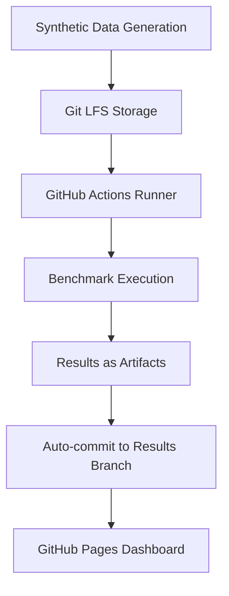
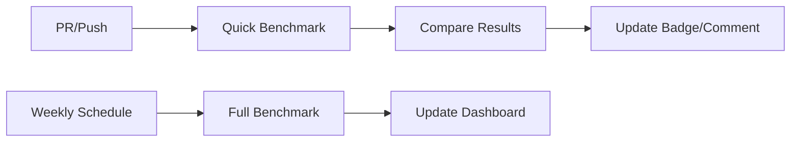

# DataSON Open Source Benchmarking Strategy

## Executive Summary

This document outlines a **realistic and sustainable** benchmarking strategy for DataSON that will be executed as an **open source project** using free GitHub Actions and community contributions. The goal is to create accurate, reproducible benchmarks that position DataSON in the competitive landscape while being maintainable by one person part-time.

## 🎯 Strategic Objectives

### Primary Goals
1. **Competitive Positioning**: Compare DataSON against 6-8 key competitive serialization libraries
2. **Version Tracking**: Monitor DataSON's performance evolution with automated regression detection
3. **Configuration Guidance**: Identify optimal configurations for common use cases
4. **Community Benchmarks**: Enable easy reproduction and contribution of benchmarks
5. **Open Source Excellence**: Create transparent, reproducible methodology using free tools

### Success Metrics
- **Accurate Comparison**: Fair benchmarks against 6-8 major competing libraries
- **Automation**: 90% automated execution through GitHub Actions
- **Community Friendly**: Easy setup and contribution process
- **Maintainability**: <4 hours/week maintenance by one person
- **Reproducibility**: Anyone can run the benchmarks and get consistent results

## 🏗️ Architecture Overview

### GitHub-Based Project Structure
```
datason-benchmarks/                    # Separate public GitHub repository
├── .github/workflows/                # GitHub Actions automation
│   ├── daily-benchmarks.yml         # Daily automated benchmarks
│   ├── pr-performance-check.yml     # PR performance validation
│   └── weekly-competitive.yml       # Weekly competitive analysis
├── benchmarks/                       # Core benchmark suites
│   ├── competitive/                  # Competitor comparisons
│   ├── configurations/              # DataSON config testing
│   └── regression/                   # Performance regression tests
├── data/                            # Test datasets and results
│   ├── synthetic/                   # Generated test data
│   ├── results/                     # Historical benchmark results
│   └── configs/                     # Test configurations
├── scripts/                         # Automation scripts
│   ├── setup.py                     # Environment setup
│   ├── run_benchmarks.py           # Main benchmark runner
│   └── generate_report.py          # Results analysis
├── competitors/                     # Competitor implementations
│   ├── orjson_adapter.py           # orjson benchmark adapter
│   ├── ujson_adapter.py            # ujson benchmark adapter
│   └── pickle_adapter.py           # pickle benchmark adapter
├── docs/                           # Documentation and reports
│   ├── setup.md                    # Quick start guide
│   ├── results/                    # Auto-generated reports
│   └── methodology.md              # Benchmark methodology
└── requirements.txt                # Python dependencies
```

## 📊 Competitive Analysis - Focused Approach

### Primary Competitors (Focus Group)
**6-8 Key Libraries** for realistic comparison and maintenance:

1. **orjson** - The speed benchmark standard
   - Why: Industry-leading JSON performance, native type support
   - Tests: Speed, datetime/UUID handling, memory usage

2. **ujson** - Popular drop-in replacement
   - Why: Widely adopted, good balance of speed and compatibility
   - Tests: Real-world performance, compatibility

3. **standard json** - Python baseline
   - Why: Built-in reference, universal availability
   - Tests: Baseline comparison, feature compatibility

4. **pickle** - Complex object serialization
   - Why: Python's default for complex objects
   - Tests: Complex types, security trade-offs

5. **jsonpickle** - JSON-based object serialization
   - Why: Direct functional competitor to DataSON
   - Tests: Feature parity, human-readable output

6. **msgpack** - Binary format alternative
   - Why: Compact binary, cross-language compatibility
   - Tests: Size efficiency, speed trade-offs

**Optional (based on availability)**:
7. **simplejson** - Pure Python with features
8. **cloudpickle** - Extended pickle for distributed computing

### Competitive Testing Strategy
```python
# Automated competitor setup - GitHub Actions friendly
competitors = {
    'orjson': {'pip': 'orjson', 'import': 'orjson'},
    'ujson': {'pip': 'ujson', 'import': 'ujson'},
    'json': {'pip': None, 'import': 'json'},  # Built-in
    'pickle': {'pip': None, 'import': 'pickle'},  # Built-in
    'jsonpickle': {'pip': 'jsonpickle', 'import': 'jsonpickle'},
    'msgpack': {'pip': 'msgpack', 'import': 'msgpack'}
}
```

## 🔄 DataSON Version Tracking - Automated Approach

### GitHub Actions Integration
**Automated version tracking** with minimal maintenance overhead:

#### Automated Version Testing
```yaml
# .github/workflows/version-comparison.yml
name: Version Performance Tracking
on:
  schedule:
    - cron: '0 2 * * 1'  # Weekly on Monday
  workflow_dispatch:

jobs:
  track-versions:
    runs-on: ubuntu-latest
    strategy:
      matrix:
        datason-version: ['0.9.0', '0.10.0', '0.11.0', 'latest']
    steps:
      - name: Install DataSON version
        run: pip install datason==${{ matrix.datason-version }}
      - name: Run benchmarks
        run: python scripts/version_benchmark.py
      - name: Store results
        uses: actions/upload-artifact@v4
```

### Key Tracking Metrics (Automated)
1. **Performance Trends**: Automated regression detection for new releases
2. **Memory Usage**: Track memory patterns with simple profiling
3. **Feature Costs**: Performance impact of new capabilities
4. **API Changes**: Breaking change detection through testing

### Practical Version Coverage
**Focus on recent/important versions**:
- **Current stable**: Latest release performance baseline
- **Previous major**: Version comparison for upgrade decisions  
- **Development**: Main branch performance tracking
- **Historical**: 3-4 key milestone versions (0.9.0, 0.10.0, 0.11.0)

## ⚙️ Configuration Testing - Practical Approach

### Key Configuration Scenarios
**Focus on real-world use cases** instead of exhaustive combinations:

#### Common Use Case Configurations
```python
# 8-12 realistic configurations instead of 3,125
test_configs = {
    'api_fast': {
        'description': 'Fast API responses',
        'config': {'performance': 'fast', 'security': 'basic'}
    },
    'ml_training': {
        'description': 'ML model serialization',
        'config': {'ml_mode': 'advanced', 'memory': 'chunked'}
    },
    'secure_storage': {
        'description': 'Secure data storage',
        'config': {'security': 'strict', 'performance': 'balanced'}
    },
    'large_data': {
        'description': 'Large dataset handling',
        'config': {'memory': 'streaming', 'performance': 'balanced'}
    },
    'default': {
        'description': 'Out-of-box experience',
        'config': {}  # Default settings
    }
}
```

#### Automated Configuration Testing
```yaml
# GitHub Actions matrix for configuration testing
strategy:
  matrix:
    config: [api_fast, ml_training, secure_storage, large_data, default]
    data_type: [small_objects, pandas_df, numpy_arrays, complex_nested]
```

### Configuration Insights
- **Best Practice Recommendations**: Auto-generated based on benchmark results
- **Use Case Optimization**: Performance profiles for different scenarios
- **Trade-off Analysis**: Security vs speed vs memory trade-offs

## 📈 Performance Testing - GitHub Actions Friendly

### Simplified Performance Tests
**Focus on practical scenarios** within GitHub Actions limits:

#### Basic Performance Scenarios
```python
# Simple tests that run in <10 minutes on GitHub Actions
test_scenarios = {
    'small_objects': {
        'description': 'API-style small objects',
        'data_size': '< 1KB',
        'iterations': 10000,
        'focus': 'throughput'
    },
    'medium_data': {
        'description': 'Document-style data',
        'data_size': '1KB - 100KB',
        'iterations': 1000,
        'focus': 'balanced_performance'
    },
    'large_datasets': {
        'description': 'ML model/dataset handling',
        'data_size': '1MB - 10MB',
        'iterations': 50,
        'focus': 'memory_efficiency'
    },
    'memory_pressure': {
        'description': 'Memory usage patterns',
        'test': 'gradual_size_increase',
        'focus': 'memory_scaling'
    }
}
```

#### Performance Metrics (Lightweight)
1. **Serialization Speed**: Operations per second for different data sizes
2. **Memory Usage**: Peak memory consumption tracking
3. **Size Efficiency**: Serialized size vs original data size
4. **CPU Usage**: Basic CPU profiling during operations

### GitHub Actions Performance Testing
```yaml
# .github/workflows/performance.yml - runs in ~15 minutes
name: Performance Benchmarks
on: [push, pull_request]
jobs:
  performance-test:
    runs-on: ubuntu-latest
    timeout-minutes: 20
    steps:
      - name: Quick Performance Check
        run: python scripts/quick_benchmark.py
      - name: Memory Profiling  
        run: python scripts/memory_test.py
      - name: Compare with Baseline
        run: python scripts/compare_results.py
```

## 🌐 Free Infrastructure Strategy

### GitHub Actions as Infrastructure
**Zero-cost infrastructure** using GitHub's free tier:

#### GitHub Actions Benefits
- **Free compute**: 2,000 minutes/month for public repos (unlimited for public repos)
- **Cross-platform**: Linux, Windows, macOS runners
- **Matrix builds**: Test multiple Python versions/configurations simultaneously
- **Artifact storage**: Store results and historical data
- **Scheduling**: Automated daily/weekly benchmarks

#### Infrastructure Components (Free)
```yaml
compute:
  - provider: "GitHub Actions"
    runners: "ubuntu-latest, windows-latest, macos-latest"
    cost: "$0/month"
  
storage:
  - provider: "GitHub Artifacts + Git LFS"
    purpose: "benchmark results and test data"
    cost: "$0/month (within limits)"
  
monitoring:
  - provider: "GitHub Actions + simple scripts"
    tools: ["python logging", "csv reports", "markdown dashboards"]
    cost: "$0/month"
```

### Data Management (GitHub-Based)


### Backup Infrastructure (Optional)
- **Personal cloud**: Use maintainer's existing cloud credits for extended testing
- **Community resources**: Contributors can run extended benchmarks
- **Sponsor infrastructure**: GitHub Sponsors funding for additional compute

## 📊 Test Data Strategy - Simple & Effective

### Automated Test Data Generation
**Realistic test data** without complex infrastructure:

#### Core Data Types (Automated Generation)
```python
# Simple data generators that run in GitHub Actions
data_generators = {
    'api_data': {
        'description': 'Typical API response data',
        'examples': ['user profiles', 'product catalogs', 'order history'],
        'generation': 'faker + random patterns'
    },
    'scientific_data': {
        'description': 'NumPy/Pandas data common in ML',
        'examples': ['time series', 'feature matrices', 'model weights'],
        'generation': 'numpy.random + pandas factories'
    },
    'complex_objects': {
        'description': 'Nested Python objects',
        'examples': ['config files', 'nested dicts', 'class instances'],
        'generation': 'recursive generation patterns'
    },
    'edge_cases': {
        'description': 'Boundary conditions',
        'examples': ['very large numbers', 'unicode strings', 'circular refs'],
        'generation': 'explicit edge case construction'
    }
}
```

#### Realistic Variance (Simple Implementation)
```python
# Lightweight variance without complex statistics
test_data_config = {
    'size_mix': {
        'small_fast': 70,    # Quick turnaround tests
        'medium_realistic': 25,  # Real-world sized data
        'large_stress': 5    # Memory/performance limits
    },
    'complexity_levels': {
        'simple': 40,        # Basic serialization
        'realistic': 50,     # Production patterns  
        'complex': 10        # Edge cases and stress tests
    }
}
```

### Community Data Sources
**Leveraging open source community**:

#### Open Datasets Integration
1. **Public APIs**: JSON data from REST APIs (GitHub, OpenWeather, etc.)
2. **Research Datasets**: ML datasets from Kaggle, UCI, etc.
3. **Community Examples**: User-contributed test cases
4. **Synthetic Patterns**: Generated data mimicking real patterns

#### Privacy-First Approach
- **No real PII**: Only synthetic or public data
- **Pattern-based**: Generate realistic data patterns without sensitive info
- **Community safe**: All data suitable for public repositories

## 🔄 GitHub Actions Automation

### Simple CI/CD Pipeline


### Automation Levels (Realistic)
1. **PR Checks**: Quick performance check (< 5 min, affects merge)
2. **Daily Basic**: Essential benchmarks (< 15 min, auto-run)
3. **Weekly Full**: Complete competitive analysis (< 45 min, scheduled)
4. **Release Validation**: Full test suite on releases (< 60 min, manual trigger)

### Simple Regression Detection
```python
# Lightweight regression detection - no complex statistics needed
regression_check = {
    'thresholds': {
        'fail_pr': '25% performance degradation',  # Block PR
        'warn': '10% performance degradation',     # Comment warning
        'notice': '5% performance degradation'     # Log notice
    },
    'comparison': 'main_branch_baseline',
    'alert_method': 'github_pr_comment',
    'storage': 'json_files_in_repo'
}
```

### GitHub Actions Workflows
```yaml
# Three simple workflows that do everything
workflows:
  1: "pr-benchmark.yml"     # Fast PR performance check
  2: "daily-benchmark.yml"  # Scheduled competitive analysis  
  3: "release-benchmark.yml" # Comprehensive release validation
```

## 📈 Simple Reporting & GitHub Pages

### GitHub Pages Dashboard
**Static site generation** for zero-cost reporting:

#### Single Dashboard with Multiple Views
- **Current Status**: Latest benchmark results and trends
- **Competitive Comparison**: Head-to-head performance charts
- **Historical Trends**: Performance evolution over time
- **Configuration Guide**: Best practices based on benchmarks

#### Auto-Generated Reports
```python
# Simple reporting that updates GitHub Pages
report_generation = {
    'dashboard_update': {
        'trigger': 'after_every_benchmark',
        'format': 'markdown -> GitHub Pages',
        'content': 'latest results + trends',
        'update_time': '< 2 minutes'
    },
    'weekly_summary': {
        'trigger': 'weekly_schedule',
        'format': 'markdown report',
        'content': 'competitive analysis summary',
        'distribution': 'commit to docs/'
    },
    'release_report': {
        'trigger': 'new_datason_release',
        'format': 'detailed markdown',
        'content': 'comprehensive performance analysis',
        'distribution': 'release notes + docs update'
    }
}
```

### Community-Friendly Reporting
#### Simple Visualization Tools
- **Matplotlib/Plotly**: Generate charts in Python scripts
- **GitHub Badges**: Real-time performance badges in README
- **CSV Results**: Raw data for community analysis
- **Markdown Tables**: Human-readable results in docs

#### Open Source Transparency
```markdown
# Example auto-generated performance summary
## DataSON vs Competitors (Latest)
| Library | Speed | Memory | Features | 
|---------|-------|--------|----------|
| DataSON | 145ms | 23MB   | ★★★★★    |
| orjson  | 89ms  | 18MB   | ★★☆☆☆    |
| ujson   | 112ms | 21MB   | ★★☆☆☆    |
| pickle  | 78ms  | 31MB   | ★★★★☆    |

*Updated: 2024-01-15 via GitHub Actions*
```

## 🎯 Implementation Roadmap - Realistic Timeline

### Phase 1: Quick Start (Week 1-2)
**Get basic benchmarking running**
- ⚡ Set up GitHub repository structure
- ⚡ Create basic benchmark scripts for 3-4 key competitors
- ⚡ Set up simple GitHub Actions workflow
- ⚡ Generate first competitive comparison report
- ⚡ Create GitHub Pages dashboard template

### Phase 2: Automation (Week 3-4)  
**Make it self-sustaining**
- 🔄 Add automated data generation
- 🔄 Implement regression detection for PRs
- 🔄 Set up scheduled weekly benchmarks
- 🔄 Create configuration testing scenarios
- 🔄 Add historical trend tracking

### Phase 3: Polish (Month 2)
**Make it community-ready**
- ✨ Improve documentation and setup instructions
- ✨ Add remaining competitive libraries (6-8 total)
- ✨ Enhance reporting with charts and insights
- ✨ Add DataSON version comparison capabilities
- ✨ Create contribution guidelines for community

### Phase 4: Community Growth (Ongoing)
**Sustainable part-time maintenance**
- 🌱 Monthly competitive landscape updates
- 🌱 Community contribution integration
- 🌱 Quarterly methodology improvements
- 🌱 Response to new DataSON features/releases
- 🌱 Quarterly benchmark methodology reviews

## 💰 Resource Requirements - Open Source Budget

### Infrastructure Costs (Monthly)
```yaml
compute_resources:
  github_actions: "$0/month"  # Free for public repos
  github_pages: "$0/month"    # Free hosting
  git_lfs: "$0/month"        # Free tier sufficient
  
optional_services:
  domain_name: "$12/year"     # Custom domain (optional)
  extended_lfs: "$5/month"    # If needed for large datasets
  
total_monthly: "$0-5/month"
annual_estimate: "$0-72/year"
```

### Human Resources (Part-Time)
- **Maintainer**: 3-4 hours/week average
  - **Setup Phase**: 8-10 hours/week for 4 weeks (initial setup)
  - **Maintenance Phase**: 2-3 hours/week (ongoing)
  - **Enhancement Phase**: 4-6 hours/week (quarterly improvements)

### Time Breakdown
```yaml
weekly_maintenance:
  monitoring_results: "30 minutes"
  responding_to_issues: "1 hour"
  updating_competitors: "30 minutes"
  improving_automation: "1 hour"
  total_weekly: "3 hours average"

quarterly_enhancements:
  methodology_improvements: "4 hours"
  new_competitor_integration: "6 hours"
  reporting_enhancements: "4 hours"
  community_feedback: "2 hours"
  total_quarterly: "16 hours (1 hour/week average)"
```

### Value Proposition (Open Source)
1. **Community Trust**: Transparent performance data builds adoption
2. **Developer Efficiency**: Clear performance guidance saves user time
3. **Quality Assurance**: Automated regression detection prevents issues
4. **Market Position**: Credible benchmarks improve DataSON's reputation

## 🚀 Success Metrics - Realistic Goals

### Technical Success Metrics
1. **Basic Coverage**: Benchmark 6-8 key competitors consistently
2. **Automation Success**: 90% of benchmarks run without manual intervention
3. **Regression Detection**: Catch major performance issues before release
4. **Data Quality**: Consistent, reproducible results across runs
5. **Maintenance Load**: Stay under 4 hours/week maintenance time

### Community Impact Metrics
1. **Adoption**: DataSON users reference benchmarks for decision-making
2. **Transparency**: Regular public reports build community trust
3. **Contributions**: Community members contribute test cases or improvements
4. **Documentation**: Clear guidance helps users choose optimal configurations
5. **Issue Prevention**: Catch performance regressions before they affect users

### Operational Success Indicators
```yaml
# Simple metrics to track success
metrics:
  benchmark_reliability: "95% successful automated runs"
  maintenance_efficiency: "< 4 hours/week average time investment"
  community_value: "Referenced in GitHub issues/discussions"
  data_freshness: "Weekly competitive data updates"
  automation_health: "GitHub Actions passing consistently"
```

### Quarterly Review Criteria
1. **Are benchmarks providing value?** Users citing performance data in decisions
2. **Is maintenance sustainable?** Time investment staying reasonable
3. **Is automation working?** Minimal manual intervention needed
4. **Is data accurate?** Results consistent and explainable
5. **Is scope appropriate?** Coverage vs effort balance sustainable

## 🔮 Future Enhancements - Community Driven

### Organic Growth Opportunities
1. **Community Contributions**: User-contributed benchmark scenarios and data
2. **Extended Competitor Coverage**: Add libraries based on user requests
3. **Enhanced Reporting**: Better visualizations as community provides feedback
4. **Real-World Scenarios**: Benchmark cases from actual user workloads
5. **Cross-Platform Testing**: Windows/macOS testing if community needs arise

### Potential Collaborations
1. **Other Open Source Projects**: Share benchmarking methodology and tools
2. **Research Community**: Academic papers on serialization performance
3. **Conference Presentations**: Share insights at Python conferences
4. **Documentation Improvements**: Community-driven methodology refinements
5. **Tool Ecosystem**: Integration with profiling and analysis tools

### Sustainable Innovation
```yaml
enhancement_philosophy:
  priority: "community_value_over_complexity"
  approach: "incremental_improvements"
  decision_criteria: "maintenance_impact_vs_user_benefit"
  resource_constraint: "part_time_maintainable"
```

---

## 📋 Conclusion

This **realistic and sustainable** benchmarking strategy provides DataSON with:

1. **Accurate Data**: Reliable competitive performance comparison using free tools
2. **Community Value**: Transparent benchmarks that help users make informed decisions
3. **Sustainable Maintenance**: Part-time maintainable automation using GitHub Actions
4. **Open Source Excellence**: Reproducible methodology that others can adopt
5. **Practical Insights**: Actionable performance guidance for real-world usage

The GitHub Actions approach ensures **zero infrastructure costs** while providing credible, automated benchmarking that builds community trust and helps position DataSON accurately in the competitive landscape.

**Next Steps**: 
1. **Week 1**: Set up GitHub repository and basic competitor comparison
2. **Week 2**: Create first automated GitHub Actions workflow  
3. **Week 3**: Add data generation and regression detection
4. **Week 4**: Launch public dashboard and documentation

**Total time investment**: ~30-40 hours for full setup, then 3-4 hours/week maintenance.